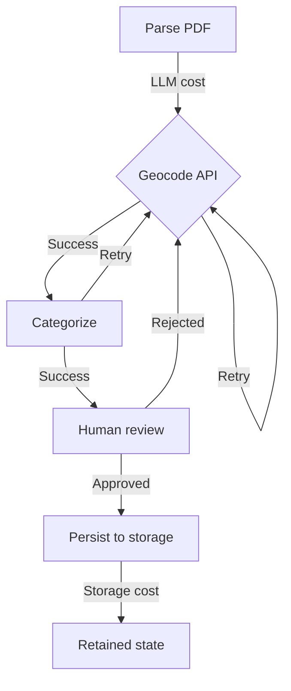

# Agentic FinOps is a trap

## The conventional wisdom and where it stops

The prevailing advice is to treat autonomous AI workflows like any other microservice: instrument, observe, tune until the cost curve bends downward. Managed LLM observability platforms and open-source metric stacks promise to surface every dollar and millisecond. The pitch is simple: if you can measure token cost and latency per step, you can optimize them. Teams have internalized this playbook from the cloud-native era and assume the same rigor applies to agents.

That playbook is a poor fit for the actual problem. Autonomous workflows are not stateless functions; they are state machines with nondeterministic jumps, retries, and human-in-the-loop loops. The moment an agent calls a tool, schedules a retry, or waits on a human approval, the standard model loses track of cost.

The core issue is that most FinOps tooling treats an agent as a single function call. It reports LLM cost per step and call latency, but it has no visibility into the fact that an agent may retry the same tool call several times because the upstream response changed mid-flow. It has no field for the seconds a human reviewer spent approving a step that cost a fraction of a cent in tokens. It does not surface the cost of storing conversation context for a retention window when a retry loop doubles the context size on every pass. Step-level observability hooks capture step-level metrics, not the state bloat that accumulates when an agent loops on a failed tool response.

This is not an argument against observability. It is an argument that the unit of accounting is wrong: per-call cost is the wrong denominator when the cost is driven by cumulative state and retry behavior.

## What happens when you follow the standard advice

Consider a typical agentic system built on a managed agent framework, running on a serverless compute platform, instrumented with a hosted trace and cost tracker. The team builds a dashboard showing average LLM cost per run and average latency. Both look healthy. The FinOps alert stays green.

Weeks later the bill spikes. The dashboard still shows the same per-run token cost, but the real infrastructure cost per run is far higher. The gap comes from costs the per-call model never captured:

- Retry bloat. The agent calls a third-party geocoding API that occasionally returns a 503. The retry policy triggers several times, and each attempt appends a chunk of conversation context to the state store. The storage line item grows by an order of magnitude per run, while the LLM cost line stays flat.
- State drift. The agent's memory store grows over days because the agent appends partial results from failed tool calls. Eviction policies never fire because memory usage ramps slowly and the alert threshold sits well above the current level. Eventually the cache miss ratio climbs, forcing invocations to hit slower backing storage and, in some designs, to re-call the LLM to reconstruct context.
- Human-in-the-loop drift. The agent starts routing a fraction of runs to a human reviewer because a tool's output schema drifted. Each review costs platform time plus allocated reviewer salary. The FinOps tooling has no field for human labor cost, so it is invisible.

A common failure mode is that the team blames the LLM provider for the spike rather than the retry loop or the memory growth. The per-call metric was never wrong; it was answering a different question.

## A different mental model

Agentic FinOps should stop treating the agent as a function and start treating it as a distributed system with state, retries, and human hand-offs. The mental model becomes a graph where each node is a stateful step (tool call, human review, retry loop) and each edge carries two costs: compute/API cost and state-storage cost.

A concrete example. An agent that processes expense reports might have these steps:

1. Parse PDF receipt (LLM call)
2. Call geocoding API for vendor location (API call)
3. Call expense categorization API (API call)
4. Human reviewer approval (human labor)
5. Persist report to object storage (storage)

The standard FinOps model tracks steps 1–3. The real cost graph includes the retry edges and the human node:


```mermaid
flowchart TD
    A[Parse PDF] -->|LLM cost| B{Geocode API}
    B -->|Success| C[Categorize]
    B -->|Retry| B
    C -->|Success| D[Human review]
    C -->|Retry| B
    D -->|Approved| E[Persist to storage]
    D -->|Rejected| B
    E -->|Storage cost| F[Retained state]
```

The hidden costs are:

- Retry loops on B and C that add state to the memory store (context bloat).
- Human review time that scales with retry counts.
- Storage growth in the object store when rejected reports are archived but never cleaned up.

The FinOps model therefore has to track not just the step cost but the cumulative state cost across the graph. A managed compute monitoring service can surface the memory growth curve, but it will not tell you which agent runs triggered the growth. That requires a custom metric:

```
state_bloat_per_run = (memory_delta_over_window) / (agent_runs_in_window)
```

The units matter. Bytes per run is the actionable number, because it lets you compare a retry-heavy run against a clean one.

## How to measure this yourself

None of the above is useful without instrumentation. Here is what to capture and how to compare it.

**State growth.** Export the memory usage of your state store (Redis `INFO memory`, or the equivalent metric from your managed cache) on a fixed interval. Record the agent run count over the same interval. Compute the delta per run. Compare the value for runs that hit a retry against runs that did not. If retry runs show a materially higher bytes-per-run figure, the retry path is the leak.

**Retry rate.** Count tool invocations and tool failures per agent run. A retry policy with exponential backoff reduces the number of retries but does not eliminate them; a 5% tool error rate still means 5% of runs carry extra state. Track the distribution, not the average.

**Human hand-off rate and time.** Log the timestamp when a run enters a human review queue and when it leaves. Multiply the elapsed time by an allocated hourly rate to get a per-review cost. This number belongs next to the token cost, not in a separate spreadsheet.

**Cache hit ratio.** If your agent reconstructs context from a cache, a falling hit ratio is an early signal that state has grown past the cache's effective working set. Plot hit ratio against state size over the same window.

**Cost reconciliation.** Once a month, compare the sum of your per-call metrics against the actual bill for the agent's infrastructure. The gap is the size of the blind spot. If the gap is growing, the per-call model is drifting further from reality.

## The cases where the conventional model is right

There are scenarios where the standard model works fine.

If the agent is purely LLM-driven with no tools, no retries, and no human hand-offs, the per-call model is sufficient. A summarization agent that calls an LLM once per request and stores only the result has LLM cost as its dominant cost, and latency is dominated by the LLM call. Token-based cost tracking is enough.

If the agent uses serverless tools with fixed costs and bounded state, the standard model also holds. A weather agent that calls a single API with a fixed cost per call will show up accurately in the dashboard, and state growth is negligible.

The deciding factor is whether the agent's state grows faster than the monitoring window can observe. If state growth is bounded and predictable, the standard model works. If it is unbounded or unpredictable, it fails.

## Decision checklist

Use this to choose a strategy. The table is a comparison of agent characteristics against what the standard model can and cannot see.

| Agent characteristic | Does standard FinOps see the cost? | What to add |
|---|---|---|
| Stateless LLM-only agent | Yes | Nothing |
| Bounded tool calls, fixed cost per call | Yes | API cost tracking |
| Unbounded retries | No | State growth metric, retry rate |
| Human-in-the-loop hand-offs | No | Labor cost field, review timestamps |
| Tool schema drift | No | Schema versioning, drift detection |
| Context reconstructed from cache | Partially | Cache hit ratio vs. state size |

The rule of thumb: if state growth per run exceeds what your monitoring window can resolve, you need extended state tracking. A monitoring window that samples once a day cannot see a leak that doubles every hour.

## Common objections

**"Our observability dashboard shows everything we need."** It shows step-level metrics, not state growth. It will show LLM cost per step and API call cost, but not the storage cost of retry state or the memory growth from accumulated partial results.

**"We run on Kubernetes with autoscaling, so our state is bounded."** Autoscaling bounds CPU and memory at the pod level. It does not bound the conversation context stored in Redis or object storage. The pod's memory usage may be capped; the state is not.

**"Our retry policy is exponential backoff, so retries are rare."** Backoff reduces the number of retries but does not eliminate them. If the tool's error rate is 5%, the retry path fires on 5% of runs, and those runs carry the extra state cost. The average hides it; the distribution reveals it.

**"We use serverless, so state is ephemeral."** Serverless state is ephemeral only for successful runs. Failed runs still leave state behind in logs, traces, and partial writes. A retry loop adds state to the cache even when the final run succeeds.

## Practical starting points

If you are building an agentic system, these are the design choices that keep cost observable.

**Instrument state growth from day one.** Add a custom metric for bytes per run and alert on sustained growth over a rolling window. Compare retry runs against clean runs.

**Track human labor cost explicitly.** Add a field for review minutes and allocate reviewer time per run. A simple formula:

```python
# Illustrative allocation: reviewer salary / annual hours / 60
reviewer_cost_per_minute = 65000 / (2000 * 60)  # ~0.54 per minute

def human_review_cost(minutes_spent):
    return minutes_spent * reviewer_cost_per_minute
```

**Bound retry state.** Cap the conversation context size per run. If it exceeds a threshold, truncate or summarize before the next tool call.

**Model control flow explicitly.** A finite state machine with declared transitions makes state growth predictable. Free-form control flow makes it drift.

**Store state metrics in a time-series database.** State bloat is a rate, not a snapshot. A time-series store lets you plot the rate and alert on its derivative.

Here is an illustrative sketch of a state bloat tracker. It uses a Redis client and records memory size per run, then computes the growth rate over a window.

```python
from datetime import datetime, timedelta

class StateBloatTracker:
    def __init__(self, redis_client, window_hours=24):
        self.redis = redis_client
        self.window = timedelta(hours=window_hours)
        self.prefix = "agent_state:"

    def record_run(self, run_id, memory_size_bytes):
        # Store memory size at run start
        self.redis.hset(f"{self.prefix}{run_id}", mapping={"memory": memory_size_bytes})
        # Clean up runs older than window
        cutoff = datetime.utcnow() - self.window
        self.redis.zremrangebyscore("agent_runs:timestamps", 0, int(cutoff.timestamp()))

    def bloat_rate(self, current_runs=100):
        # Bytes added per run over the window
        past = datetime.utcnow() - self.window
        past_key = f"{self.prefix}{past.timestamp()}"
        current_key = f"{self.prefix}{datetime.utcnow().timestamp()}"
        past_memory = int(self.redis.hget(past_key, "memory") or 0)
        current_memory = int(self.redis.hget(current_key, "memory") or 0)
        delta = current_memory - past_memory
        return delta / current_runs

# Usage
tracker = StateBloatTracker(redis_client)
tracker.record_run("run_123", 512000)
rate = tracker.bloat_rate(current_runs=100)
if rate > 1000:  # Alert if >1 KB per run
    print(f"State bloat alert: {rate} bytes/run")
```

Note the assumptions baked into that sketch: `record_run` writes a key per run and prunes by timestamp, and `bloat_rate` reads two point-in-time keys. In production you would store the memory series and compute the delta from the series, not from two arbitrary keys. The point is the shape of the metric, not this exact implementation.

A bounded memory window is the complementary control. Most agent frameworks ship a windowed buffer that keeps only the last N messages:

```python
from langchain.memory import ConversationBufferWindowMemory

# Limit memory to last 10 messages to bound state growth
memory = ConversationBufferWindowMemory(
    k=10,
    memory_key="chat_history",
    return_messages=True
)
```

The window bounds growth per run, but it does not bound the number of runs whose state is retained. Both controls are needed.

## Summary

Agentic FinOps is not a tweak to the standard model; it is a different problem. Standard FinOps tooling is built for stateless functions, not stateful agents. The hidden costs — state growth, retry bloat, human labor — do not appear in per-call dashboards. When an agent's state grows faster than the monitoring window can resolve, the per-call model stops describing reality.

The measurable problem is not the LLM cost per call; it is the cumulative state cost across the agent graph. If you run an agentic system today, add custom metrics for state growth, human labor cost, and retry rate, and reconcile them against the actual bill monthly.

## Do this in the next 30 minutes

Open your state store's metrics dashboard and record the current memory usage and the agent run count for the last hour. Divide the memory delta by the run count to get bytes per run. Then compare that number against the same figure for runs that hit a retry. If the retry figure is materially higher, you have found the leak, and you have a number to put on a dashboard.
