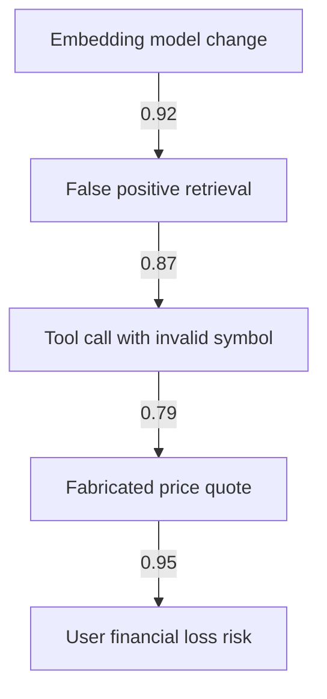

# Debug AI agents: failures aren't just bugs

## Why agent postmortems need different questions

AI agents are stateful, stochastic, and often opaque. Those three traits break the standard incident response playbook. A CPU spike or memory leak in an ordinary service is usually traceable to a single commit or config change. An agent failure can present with the same symptoms — elevated latency, a burst of errors — while the root cause sits somewhere else entirely: prompt drift, tool-use misalignment, retrieval threshold changes, or a hallucination cascade that only appears in a narrow slice of conversation contexts.

A representative failure mode: an agent's vector store is upgraded to a new embedding model overnight. Latency moves by a couple of hundred milliseconds per turn, which nobody pages on. Meanwhile the semantic distance between user intent and the retrieval threshold has shifted, so the agent starts surfacing documents it previously would have filtered out. Users get answers that are confidently wrong, and the dashboards stay green.

Standard runbooks ask about availability, latency, and correctness. Agent postmortems need three additional questions:

- Did behavior drift because of prompt drift, tool-use drift, or model drift?
- Was the failure surface area larger than the retry surface area? (It usually is — retries cover the request path, not the reasoning path.)
- Did tool calls create side effects — payments, refunds, inventory writes — that never appeared in the observability stack?

The stakes compound this. An agent that fabricates a price quote causes financial loss; one that fabricates a product recall notice causes legal exposure. Most APM tooling still treats agents as black boxes with extra latency. Until that changes, teams have to build the postmortem muscle themselves.

This article compares two approaches that are practical today: **structured failure narratives** and **LLM-assisted root cause graphs**. Neither is universally correct. The rest of this piece is about telling them apart quickly, and about the failure modes both share.

## Option A: structured failure narratives

A structured failure narrative forces rigor by making every assumption explicit. The format borrows from conventional incident postmortems but adds AI-specific prompts. Every finding must answer:

1. What changed in the agent's context window, prompt, or retrieval corpus?
2. Which tool outputs fell outside their documented schemas?
3. Did the failure propagate across conversation turns in a way that violates idempotency?

A concrete schema looks like this:

```yaml
incident_id: ai-0000-00-00
summary: "Agent recommended an unsuitable instrument after user asked about low-risk options"
timeline:
  - timestamp: 2026-01-01T14:33:00Z
    event: "Vector store embedding model changed to a higher-dimensional variant"
    impact: "Effective similarity threshold shifted, increasing false-positive retrievals"
  - timestamp: 2026-01-01T14:35:12Z
    event: "Agent called external API /stocks/quote"
    impact: "API returned stale data; agent filled the gap with a generated value"
root_causes:
  - category: "model drift"
    evidence: "Embedding drift measured via cosine similarity against a golden dataset"
    fix: "Pin embedding model version; add regression test on the golden dataset"
  - category: "schema drift"
    evidence: "Tool output schema changed; agent ignored the new currency field"
    fix: "Validate tool outputs against a declared schema before the agent reads them"
remediation:
  - rollback: true
  - hotpatch: false
  - mitigation: "Added guardrail instruction limiting financial guidance"
lessons:
  - "Pin embedding models in production"
  - "Version and validate tool output schemas"
```

The narrative format performs well when:

- The team already uses structured incident formats and has an incident database.
- Legal or compliance reviewers must sign off, and they want deterministic, citable evidence.
- The failure is prompt drift in multi-turn conversations, where the symptom only appears after several exchanges.

Its weaknesses are real and worth stating plainly:

- Writing the narrative is slow. A medium-severity incident can consume several hours of engineer time.
- It assumes the failure context is reproducible, which stochastic models do not guarantee.
- Tool-use side effects are invisible unless they were instrumented before the incident.

A common gap: an agent calls an endpoint that is not the one the team believes it is calling — a staging host reachable because of a permissive key policy, for example. The call returns success, no alert fires, and the narrative records a healthy tool call. The format only helps if endpoint-level telemetry exists to contradict it.

## Option B: LLM-assisted root cause graphs

The second approach treats the postmortem as a graph traversal problem. Ingest the available artifacts — logs, traces, metrics, tool outputs, conversation history — and let a model propose a causal graph with confidence scores. The output is a directed acyclic graph whose nodes are events and whose edges are causal links, each annotated with a confidence value.

A typical pipeline:

1. Collect all traces in a time window around the incident.
2. Run a summarization step that extracts structured events (timestamp, event type, source).
3. Ask a model to propose causal edges between events and assign confidence scores.
4. Surface the top edges above a confidence threshold for human review.

A trace snippet in OpenTelemetry-style JSON might look like:

```json
{
  "name": "agent.tool_call",
  "timestamp": "2026-01-01T14:35:12.001Z",
  "attributes": {
    "tool.name": "stock_quote",
    "tool.input": {"symbol": "EXAMPLE"},
    "model": "example-model",
    "conversation_id": "conv_abc123"
  }
}
```

The proposed graph, simplified:


```mermaid
graph TD
  A[Embedding model change] -->|0.92| B[False positive retrieval]
  B -->|0.87| C[Tool call with invalid symbol]
  C -->|0.79| D[Fabricated price quote]
  D -->|0.95| E[User financial loss risk]
```

The graph approach performs well when:

- The incident involves complex multi-turn conversations with chains of tool calls.
- Tracing is rich enough to correlate conversation turns with tool calls.
- The team prefers interactive exploration over static documents.

Its weaknesses:

- Confidence scores can mislead. The top-ranked edge is sometimes wrong.
- Hallucinated edges occur, and they require human review to catch.
- Upfront instrumentation cost is significant: traces, conversation snapshots, and tool schemas all have to exist first.

A characteristic failure: the model proposes that a prompt change caused the incident because a prompt edit timestamp sits near the incident window, when the prompt had not changed in weeks. The causal link is coincidental. A sanity-check step that compares proposed edges against a golden timeline of changes catches most of these, but only if that timeline is maintained.

## Comparing the two approaches

The table below describes the shape of the tradeoff rather than measured results. The numbers to fill in are yours; the section after the table explains how to collect them.

| Dimension | Structured narratives | LLM-assisted graphs |
|---|---|---|
| Time to first hypothesis | Slower: requires a human to read artifacts | Faster: synthesis is automated |
| Reproducibility | High: the document is static and re-readable | Lower: depends on model version, prompt, and sampling |
| Telemetry prerequisites | Logs and metrics may suffice | Traces, conversation snapshots, tool schemas required |
| Reviewability by non-engineers | High | Low to medium |
| Handling of stochastic causes | Requires deliberate conversion to deterministic tests | Native, but with false-positive risk |
| Cost profile | Human hours | Compute plus human review of low-confidence edges |

Both approaches share a blind spot: tool-use side effects outside the instrumentation boundary. If an agent calls an endpoint that returns HTTP 200 without performing the requested action — a refund that never issues, for instance — neither a narrative nor a graph will surface it unless the endpoint itself is instrumented or the tool response is validated against an expected schema.

The practical fix for that blind spot is not a postmortem technique at all. It is middleware: validate tool outputs against declared schemas before the agent consumes them, enforce idempotency keys on every side-effecting call, and alert on schema violations. That converts an invisible failure into a visible one, which is a precondition for either method working.

## How to measure which one fits

The comparison above is a shape, not a benchmark. To get real numbers for a specific team, instrument the following and compare over a fixed window of incidents — twenty is a reasonable starting sample.

**Time to first hypothesis.** Record the wall-clock time from incident declaration to the first written causal claim, whether in a narrative or a graph. This is a timestamp, not an estimate.

**Time to resolution.** Record from declaration to the point where the fix is verified in production. Keep the definition identical across both methods or the comparison is meaningless.

**Human review hours.** Sum the engineer time spent reading, correcting, and approving the output. For graphs, this includes time spent rejecting hallucinated edges.

**Edge precision.** For graphs, sample the proposed edges and label each as confirmed or rejected. The ratio of confirmed to total is the precision. For narratives, the equivalent is the fraction of stated root causes that survive review.

**Reproducibility.** Re-run the investigation a few weeks later with the same artifacts and check whether the output converges. Narratives tend to reproduce exactly because they are static; graphs reproduce only if the model version and prompt are pinned.

**Instrumentation coverage.** Count the fraction of tool calls that emit a trace with input and output. This number predicts how well either method will work far more reliably than any tooling choice.

One arithmetic note, shown so the assumption is explicit: if a team handles two incidents per month and each incident consumes six engineer-hours under one method and three under another, the difference is six engineer-hours per month, or seventy-two per year. Whether that is worth the instrumentation cost depends entirely on the loaded hourly rate and on how much of the instrumentation is reusable for other purposes — which, for tracing, is usually most of it.

## A decision checklist

Work through these in order. The first question usually settles it.

1. **Are the failure's causes deterministic or stochastic?** A tool schema change or a config rollback is deterministic; embedding drift or sampling variance is stochastic. Deterministic causes favor narratives. Stochastic causes favor graphs, with a regression test added afterward to convert the cause into something checkable.

2. **What is the instrumentation coverage?** Conversation turns, tool inputs and outputs, and trace IDs propagated through generations are the minimum for graphs. If only logs and basic metrics exist, start with narratives and invest in tracing.

3. **Who reviews the output?** Legal and compliance reviewers generally want a static document with citable evidence. ML engineers generally prefer an interactive graph. If both groups must sign off, produce the narrative and keep the graph as a working artifact.

4. **Does the agent have side-effecting tools?** If it writes to payments, inventory, or refunds, the postmortem must cover tool outputs regardless of method. Default to the narrative here, because the evidence trail matters more than the synthesis speed.

5. **Is the failure inside or outside your control?** If a third-party dependency throttled requests or changed behavior, neither method is the right tool. The work is client-side: retry logic, circuit breakers, and fallback paths. Check external dependencies before starting root cause analysis.

## Failure modes to watch for

**Coincidental causality in graphs.** A model will happily connect two events that share a timestamp. Maintain a golden timeline of deploys, config changes, and model swaps, and reject any proposed edge that contradicts it.

**Narrative theater.** A narrative that is written to look complete but omits unverified claims is worse than no narrative, because it creates false confidence. Every root cause should carry its evidence inline.

**Silent success on side effects.** A 200 response is not proof that the action happened. Instrument the endpoint, or validate the response body against an expected schema.

**Unpinned models and prompts.** If the embedding model, the generation model, or the analysis prompt can change without a recorded version, neither method reproduces. Pin all three.

**Postmortems that never become tests.** A root cause that does not turn into a regression test will recur. The output of any postmortem should include at least one automated check.

## What to do in the next 30 minutes

Open your agent's trace data and pick the most recent incident. Check three things: whether `tool_call`-style spans carry both input and output, whether a trace ID propagates from the conversation turn into every tool call, and whether any side-effecting call has its response body validated against a schema. Write down which of the three is missing. That gap, not the choice between narratives and graphs, is what determines whether the next postmortem finds the root cause.
