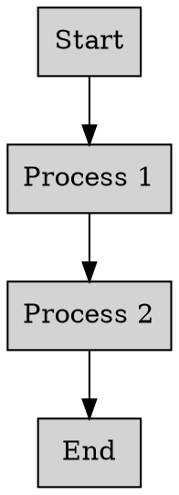

# Write to Thrive

## Introduction to Technical Writing
Technical writing is a highly specialized field that requires a unique blend of technical expertise, writing skills, and attention to detail. As a technical writer, your primary goal is to communicate complex technical information in a clear, concise, and engaging manner. In this article, we will delve into the world of technical writing, exploring the essential skills, tools, and best practices required to succeed in this field.

### Key Skills for Technical Writers
To become a successful technical writer, you need to possess a combination of technical, writing, and soft skills. Some of the key skills required include:
* Strong understanding of technical concepts and terminology
* Excellent writing and editing skills
* Ability to create visual aids such as diagrams, flowcharts, and screenshots
* Familiarity with help authoring tools and content management systems
* Strong analytical and problem-solving skills
* Ability to work independently and as part of a team

For example, let's consider a technical writer working on a user manual for a software application. The writer needs to have a strong understanding of the software's features and functionality, as well as the ability to create clear and concise instructions for the end-user. Here is an example of how the writer might use a tool like MadCap Flare to create a topic-based help system:
```markdown
# Software User Manual
## Getting Started
To install the software, follow these steps:
1. Download the installation package from the company website.
2. Run the installation package and follow the prompts to complete the installation.
3. Launch the software and log in with your username and password.

## Using the Software
The software provides a range of features and tools to help you manage your projects. Some of the key features include:
* Project planning and scheduling
* Task assignment and tracking
* Time tracking and reporting
* Collaboration and communication tools
```
In this example, the technical writer has used a combination of text, images, and formatting to create a clear and easy-to-follow user manual.

## Tools and Platforms for Technical Writing
There are a wide range of tools and platforms available to support technical writing, from help authoring tools like MadCap Flare and Paligo, to content management systems like WordPress and Drupal. Some of the key considerations when selecting a tool or platform include:
* Ease of use and learning curve
* Features and functionality
* Integration with other tools and systems
* Cost and licensing model
* Support and maintenance

For example, let's consider a company that wants to create a knowledge base for its customers. The company might choose to use a platform like Zendesk, which provides a range of features and tools for creating and managing knowledge bases. Here is an example of how the company might use Zendesk to create a knowledge base:
```python
import requests

# Set API credentials
username = "your_username"
password = "your_password"
url = "https://your_company.zendesk.com/api/v2/help_center/articles.json"

# Set article properties
article_title = "Getting Started with Our Software"
article_content = "This article provides an overview of our software and how to get started."

# Create a new article
response = requests.post(url, auth=(username, password), json={"article": {"title": article_title, "content": article_content}})

# Check if the article was created successfully
if response.status_code == 201:
    print("Article created successfully")
else:
    print("Error creating article")
```
In this example, the company has used the Zendesk API to create a new article in its knowledge base. The API provides a range of features and tools for managing knowledge bases, including the ability to create and update articles, as well as track user engagement and feedback.

## Best Practices for Technical Writing
There are a number of best practices that technical writers can follow to ensure that their content is clear, concise, and engaging. Some of the key best practices include:
* Using a clear and consistent tone and style
* Creating a clear and concise structure and organization
* Using visual aids and multimedia to support the text
* Providing examples and scenarios to illustrate key concepts
* Testing and iterating on the content to ensure it meets the needs of the target audience

For example, let's consider a technical writer working on a technical specification document for a new product. The writer might use a tool like Adobe FrameMaker to create a structured and formatted document, and then use a tool like Acrobat to create a PDF version of the document. Here is an example of how the writer might use FrameMaker to create a technical specification document:
```xml
<?xml version="1.0" encoding="UTF-8"?>
<specification>
    <title>Technical Specification for New Product</title>
    <intro>
        This document provides a technical specification for the new product, including its features, functionality, and performance characteristics.
    </intro>
    <section>
        <title>Product Overview</title>
        <p>The new product is a high-performance device that provides a range of features and functionality.</p>
    </section>
    <section>
        <title>Technical Requirements</title>
        <p>The product requires a range of technical specifications, including a minimum processor speed and memory capacity.</p>
    </section>
</specification>
```
In this example, the technical writer has used a combination of structured formatting and clear and concise language to create a technical specification document that meets the needs of the target audience.

## Common Problems and Solutions
There are a number of common problems that technical writers may encounter, from writer's block and lack of motivation, to difficulty in communicating complex technical concepts. Some of the key solutions include:
* Breaking down complex topics into smaller, more manageable pieces
* Using visual aids and multimedia to support the text
* Creating a clear and concise structure and organization
* Testing and iterating on the content to ensure it meets the needs of the target audience
* Seeking feedback and support from colleagues and peers

For example, let's consider a technical writer who is struggling to communicate a complex technical concept to a non-technical audience. The writer might use a tool like Graphviz to create a visual representation of the concept, and then use a tool like PowerPoint to create a presentation that explains the concept in a clear and concise manner. Here is an example of how the writer might use Graphviz to create a visual representation of the concept:

In this example, the technical writer has used a visual representation of the concept to help communicate it to a non-technical audience.

## Metrics and Performance Benchmarks
There are a number of metrics and performance benchmarks that technical writers can use to measure the effectiveness of their content, from user engagement and feedback, to metrics such as time-to-market and return on investment (ROI). Some of the key metrics and benchmarks include:
* User engagement and feedback, such as page views, unique visitors, and comments
* Time-to-market, such as the time it takes to create and publish content
* ROI, such as the revenue generated by the content compared to its cost
* Customer satisfaction, such as the level of satisfaction with the content and its ability to meet their needs

For example, let's consider a company that wants to measure the effectiveness of its technical documentation. The company might use a tool like Google Analytics to track user engagement and feedback, and then use a tool like Zendesk to measure customer satisfaction. Here is an example of how the company might use Google Analytics to track user engagement and feedback:
```python
import pandas as pd

# Load data from Google Analytics
data = pd.read_csv("google_analytics_data.csv")

# Calculate metrics such as page views and unique visitors
page_views = data["page_views"].sum()
unique_visitors = data["unique_visitors"].sum()

# Print metrics
print("Page views:", page_views)
print("Unique visitors:", unique_visitors)
```
In this example, the company has used Google Analytics to track user engagement and feedback, and then used a tool like pandas to calculate and print metrics such as page views and unique visitors.

## Conclusion and Next Steps
In conclusion, technical writing is a highly specialized field that requires a unique blend of technical expertise, writing skills, and attention to detail. By following best practices, using the right tools and platforms, and measuring the effectiveness of their content, technical writers can create high-quality content that meets the needs of their target audience. Some of the key next steps for technical writers include:
1. Developing their technical skills and knowledge, such as learning new programming languages or tools
2. Improving their writing and editing skills, such as taking courses or attending workshops
3. Staying up-to-date with the latest trends and developments in the field, such as attending conferences or reading industry publications
4. Building a portfolio of their work, such as creating a website or blog to showcase their content
5. Seeking feedback and support from colleagues and peers, such as joining a community or finding a mentor

By following these next steps, technical writers can continue to develop their skills and knowledge, and create high-quality content that meets the needs of their target audience. Additionally, companies can support their technical writers by providing the necessary tools and resources, such as training and development opportunities, and recognizing and rewarding their contributions to the organization.

Some of the key resources that technical writers can use to develop their skills and knowledge include:
* Online courses and tutorials, such as those offered by Udemy or Coursera
* Industry publications and conferences, such as the Society for Technical Communication (STC) or the Content Strategy Alliance
* Communities and forums, such as the Technical Writing subreddit or the STC forum
* Books and eBooks, such as "The Insider's Guide to Technical Writing" or "Content Strategy for the Web"

By taking advantage of these resources, technical writers can continue to develop their skills and knowledge, and create high-quality content that meets the needs of their target audience.